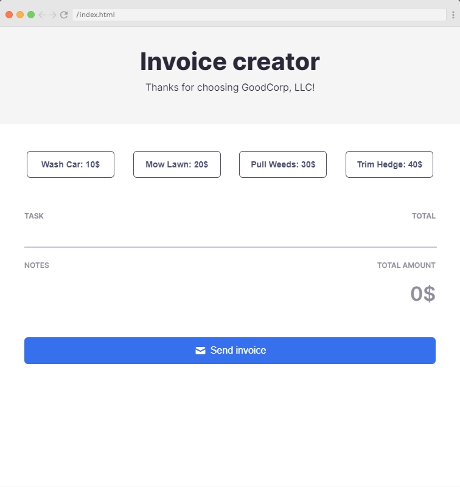

# Invoice Creator

This JavaScript application allows users to select different services (like washing a car, mowing a lawn etc.), keep track of the total cost of those services, and send an invoice.

## Code Description

The main logic of the application is encapsulated in an array of services, each with a name, price, and id. The application creates a button for each service in the array, attaches an event listener to it, and appends it to a container in the HTML document. When a button is clicked, the service is rendered in another part of the HTML document, and the total price is updated.

The "Send Invoice" button clears the selected services and resets the total price.

## Features

- Users can select services by clicking on buttons.
- Each selected service is rendered in the HTML document, with the service name and price displayed.
- The total price of all selected services is displayed.
- A "Send Invoice" button clears the selected services and resets the total price.

## Customization

You can customize the available services by modifying the `services` array. Each service should be an object with a `name`, `price`, and `id`.
